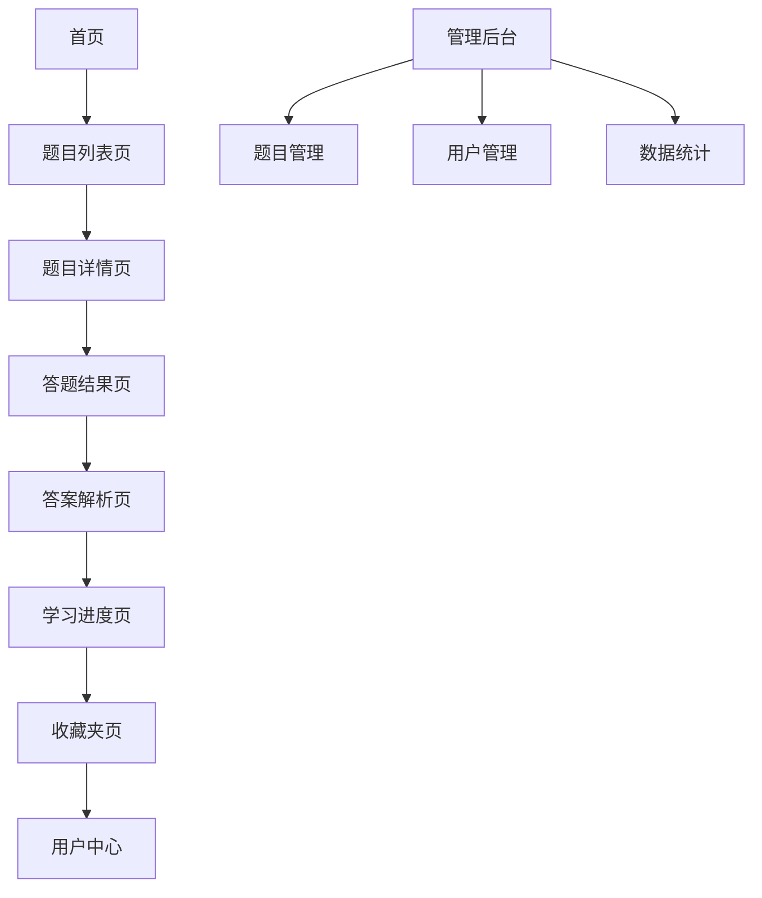

## 1. 产品概述
Java面试刷题学习网站，帮助开发者系统性准备Java技术面试。通过分类练习、难度分级、进度追踪等功能，提升用户的Java知识掌握度和面试通过率。

目标用户：正在准备Java技术面试的开发者、计算机专业学生、需要巩固Java基础知识的程序员。

## 2. 核心功能

### 2.1 用户角色
| 角色 | 注册方式 | 核心权限 |
|------|----------|----------|
| 普通用户 | 邮箱注册 | 浏览题目、答题练习、查看解析、收藏题目、学习进度追踪 |
| 管理员 | 后台创建 | 管理题目、审核内容、查看统计数据、管理用户 |

### 2.2 功能模块
网站包含以下核心页面：
1. **首页**：题目分类导航、热门题目推荐、学习进度概览。
2. **题目列表页**：分类筛选、难度筛选、搜索功能、题目列表展示。
3. **题目详情页**：题目展示、答题区域、答案解析、相关题目推荐。
4. **学习进度页**：答题统计、正确率分析、知识点掌握情况。
5. **收藏夹页**：收藏的题目标题、分类管理、快速复习。
6. **用户中心**：个人信息、学习记录、设置选项。
7. **管理后台**：题目管理、分类管理、用户管理、数据统计。

### 2.3 页面详情
| 页面名称 | 模块名称 | 功能描述 |
|----------|----------|----------|
| 首页 | 导航栏 | 提供网站主要功能入口，包括题目分类、学习进度、个人中心等快速导航。 |
| 首页 | 分类导航 | 按Java知识领域分类（基础语法、面向对象、集合框架、多线程、JVM等），点击可进入对应分类。 |
| 首页 | 热门推荐 | 展示答题量最高或收藏最多的题目，帮助用户发现优质内容。 |
| 首页 | 学习概览 | 显示用户总体学习进度，包括总答题数、正确率、连续学习天数等关键指标。 |
| 题目列表页 | 搜索栏 | 支持按关键词搜索题目内容，支持模糊匹配和精确搜索。 |
| 题目列表页 | 筛选器 | 按题目分类、难度级别（初级、中级、高级）、答题状态（未答、已答、错误）进行筛选。 |
| 题目列表页 | 题目列表 | 分页展示题目，显示题目标题、分类标签、难度标识、答题状态等基本信息。 |
| 题目详情页 | 题目展示 | 清晰展示题目内容、选项（选择题）、代码示例等题目相关信息。 |
| 题目详情页 | 答题区域 | 提供答题交互界面，支持单选、多选、填空等不同题型。 |
| 题目详情页 | 提交答案 | 用户提交答案后显示正确性，错误时给出提示。 |
| 题目详情页 | 答案解析 | 详细解释正确答案，包含相关知识点说明、代码示例、注意事项等。 |
| 题目详情页 | 相关推荐 | 根据当前题目推荐相关知识点或相似难度的其他题目。 |
| 学习进度页 | 总体统计 | 展示总答题数、正确题目数、总体正确率等基础统计数据。 |
| 学习进度页 | 分类分析 | 按知识分类统计答题情况，识别薄弱环节。 |
| 学习进度页 | 难度分析 | 按题目难度统计正确率，了解自身能力水平分布。 |
| 学习进度页 | 学习趋势 | 展示最近一段时间的答题数量和正确率变化趋势。 |
| 收藏夹页 | 收藏列表 | 展示用户收藏的所有题目，支持按分类和时间排序。 |
| 收藏夹页 | 收藏管理 | 支持批量移除收藏、添加笔记、标记重点等功能。 |
| 用户中心 | 个人信息 | 显示和编辑用户基本信息，包括昵称、邮箱、学习偏好等。 |
| 用户中心 | 学习记录 | 详细记录每次答题的时间、题目、答案、用时等信息。 |
| 用户中心 | 设置选项 | 提供答题设置、通知设置、隐私设置等个性化选项。 |
| 管理后台 | 题目管理 | 支持题目的增删改查，包括批量导入、导出功能。 |
| 管理后台 | 分类管理 | 管理题目分类体系，支持添加、修改、删除分类。 |
| 管理后台 | 用户管理 | 查看用户信息、学习数据，支持用户权限管理。 |
| 管理后台 | 数据统计 | 查看网站整体使用情况，包括用户活跃度、题目使用情况等。 |

## 3. 核心流程
### 普通用户流程
用户访问首页 → 浏览分类或搜索题目 → 选择题目进入详情页 → 阅读题目并作答 → 查看答案解析 → 收藏有价值的题目 → 查看学习进度和统计分析

### 管理员流程
管理员登录 → 进入管理后台 → 管理题目内容（添加、编辑、删除）→ 管理用户账户 → 查看数据统计和分析报告

## 4. 用户界面设计
### 4.1 设计风格
- **主色调**：深蓝色（#1e40af）作为主色，体现技术专业性；橙色（#f97316）作为强调色，用于按钮和重要提示。
- **按钮样式**：圆角矩形设计，主要操作用实心背景，次要操作用边框样式。
- **字体**：中文使用思源黑体，英文使用Inter，标题18-24px，正文14-16px，小字12px。
- **布局风格**：卡片式布局，顶部固定导航栏，内容区域采用网格系统，保证信息层次清晰。
- **图标风格**：使用线性图标，简洁现代，保持视觉一致性。

### 4.2 页面设计概览
| 页面名称 | 模块名称 | UI元素 |
|----------|----------|--------|
| 首页 | 导航栏 | 顶部固定，包含logo、主要导航菜单、搜索框、用户头像，背景白色，阴影效果。 |
| 首页 | 分类导航 | 网格布局展示分类卡片，每个卡片包含分类图标、名称、题目数量，悬停时有轻微上浮动画。 |
| 首页 | 热门推荐 | 横向滚动卡片，显示题目标题、难度标签、答题次数，使用渐变背景增强视觉吸引力。 |
| 题目列表页 | 筛选区域 | 左侧边栏设计，包含分类树形菜单、难度选择器、状态筛选，可折叠收起。 |
| 题目列表页 | 题目卡片 | 列表形式展示，每行显示题目标题、分类标签、难度星级、答题状态图标，行间分割线清晰。 |
| 题目详情页 | 题目内容 | 大字体显示题目，代码块使用语法高亮，重要概念使用彩色标记，留白充足提升可读性。 |
| 题目详情页 | 答题区域 | 选项使用大点击区域，选中状态明显标识，提交按钮醒目放置，错误提示使用友好颜色。 |
| 学习进度页 | 数据卡片 | 使用环形进度图、柱状图等可视化元素展示统计数据，色彩搭配清晰易读。 |
| 管理后台 | 数据表格 | 使用专业表格组件，支持排序、筛选、分页操作，操作按钮集中放置，提高效率。 |

### 4.3 响应式设计
采用桌面端优先设计，适配1024px以上屏幕为主。移动端采用自适应布局，主要调整：
- 导航栏转换为汉堡菜单
- 网格布局调整为单列
- 字体大小适当减小
- 交互元素增大点击区域
- 表格转换为卡片式展示

### 4.4 交互优化
- 题目切换使用平滑过渡动画
- 答题结果使用渐进式显示
- 加载状态使用骨架屏
- 错误提示使用Toast通知
- 成功操作给予视觉反馈