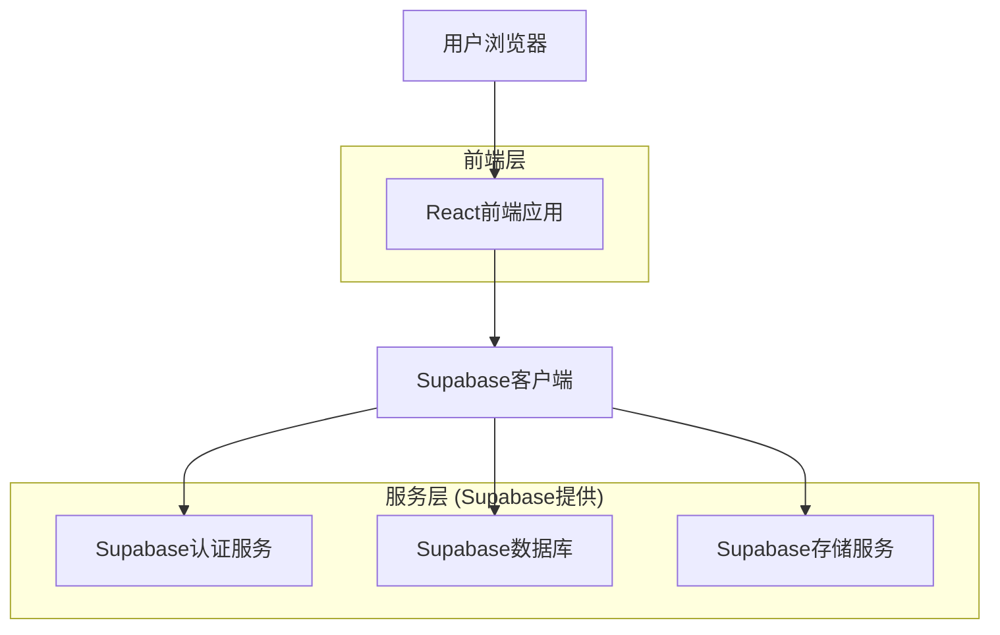
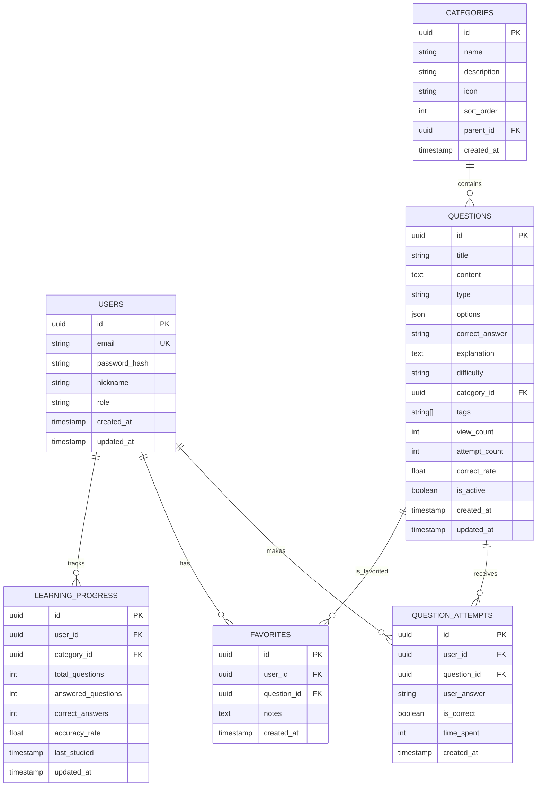

## 1. 架构设计



## 2. 技术栈描述

* **前端**: React\@18 + TypeScript + TailwindCSS\@3 + Vite

* **初始化工具**: vite-init

* **后端**: Supabase (BaaS)

* **状态管理**: React Context + useReducer

* **路由**: React Router\@6

* **UI组件**: HeadlessUI + 自定义组件

* **图表**: Chart.js + react-chartjs-2

* **代码高亮**: Prism.js

## 3. 路由定义

| 路由                | 用途                |
| ----------------- | ----------------- |
| /                 | 首页，展示分类导航和学习概览    |
| /questions        | 题目列表页，支持分类和难度筛选   |
| /questions/:id    | 题目详情页，展示题目内容和答题功能 |
| /progress         | 学习进度页，显示统计数据和分析   |
| /favorites        | 收藏夹页，管理收藏的题目标题    |
| /profile          | 用户中心，个人信息和设置      |
| /auth/login       | 登录页面              |
| /auth/register    | 注册页面              |
| /admin            | 管理后台首页            |
| /admin/questions  | 题目管理页面            |
| /admin/categories | 分类管理页面            |
| /admin/users      | 用户管理页面            |
| /admin/statistics | 数据统计页面            |

## 4. 数据模型

### 4.1 数据模型定义



### 4.2 数据定义语言

用户表 (users)

```sql
-- 创建用户表
CREATE TABLE users (
  id UUID PRIMARY KEY DEFAULT gen_random_uuid(),
  email VARCHAR(255) UNIQUE NOT NULL,
  password_hash VARCHAR(255) NOT NULL,
  nickname VARCHAR(100) NOT NULL,
  role VARCHAR(20) DEFAULT 'user' CHECK (role IN ('user', 'admin')),
  created_at TIMESTAMP WITH TIME ZONE DEFAULT NOW(),
  updated_at TIMESTAMP WITH TIME ZONE DEFAULT NOW()
);

-- 创建索引
CREATE INDEX idx_users_email ON users(email);
CREATE INDEX idx_users_role ON users(role);
```

分类表 (categories)

```sql
-- 创建分类表
CREATE TABLE categories (
  id UUID PRIMARY KEY DEFAULT gen_random_uuid(),
  name VARCHAR(100) NOT NULL,
  description TEXT,
  icon VARCHAR(50),
  sort_order INTEGER DEFAULT 0,
  parent_id UUID REFERENCES categories(id),
  created_at TIMESTAMP WITH TIME ZONE DEFAULT NOW()
);

-- 创建索引
CREATE INDEX idx_categories_parent ON categories(parent_id);
CREATE INDEX idx_categories_sort ON categories(sort_order);

-- 初始化数据
INSERT INTO categories (name, description, icon, sort_order) VALUES
('Java基础语法', 'Java语言基础、数据类型、运算符等', 'code', 1),
('面向对象', '类、对象、继承、多态、接口等', 'cube', 2),
('集合框架', 'List、Set、Map等集合类', 'database', 3),
('多线程', '线程创建、同步、并发工具等', 'cpu', 4),
('JVM', '内存模型、垃圾回收、性能调优等', 'memory', 5),
('异常处理', '异常体系、try-catch-finally等', 'alert', 6),
('IO流', '文件操作、序列化、网络编程等', 'folder', 7),
('反射机制', 'Class类、动态代理、注解等', 'mirror', 8);
```

题目表 (questions)

```sql
-- 创建题目表
CREATE TABLE questions (
  id UUID PRIMARY KEY DEFAULT gen_random_uuid(),
  title VARCHAR(255) NOT NULL,
  content TEXT NOT NULL,
  type VARCHAR(20) CHECK (type IN ('single', 'multiple', 'boolean', 'fill')),
  options JSONB,
  correct_answer VARCHAR(500) NOT NULL,
  explanation TEXT,
  difficulty VARCHAR(10) CHECK (difficulty IN ('easy', 'medium', 'hard')),
  category_id UUID REFERENCES categories(id),
  tags VARCHAR(50)[],
  view_count INTEGER DEFAULT 0,
  attempt_count INTEGER DEFAULT 0,
  correct_count INTEGER DEFAULT 0,
  correct_rate FLOAT DEFAULT 0,
  is_active BOOLEAN DEFAULT true,
  created_at TIMESTAMP WITH TIME ZONE DEFAULT NOW(),
  updated_at TIMESTAMP WITH TIME ZONE DEFAULT NOW()
);

-- 创建索引
CREATE INDEX idx_questions_category ON questions(category_id);
CREATE INDEX idx_questions_difficulty ON questions(difficulty);
CREATE INDEX idx_questions_type ON questions(type);
CREATE INDEX idx_questions_active ON questions(is_active);
CREATE INDEX idx_questions_created ON questions(created_at DESC);
```

答题记录表 (question\_attempts)

```sql
-- 创建答题记录表
CREATE TABLE question_attempts (
  id UUID PRIMARY KEY DEFAULT gen_random_uuid(),
  user_id UUID REFERENCES users(id) ON DELETE CASCADE,
  question_id UUID REFERENCES questions(id) ON DELETE CASCADE,
  user_answer VARCHAR(500),
  is_correct BOOLEAN,
  time_spent INTEGER, -- 答题用时(秒)
  created_at TIMESTAMP WITH TIME ZONE DEFAULT NOW()
);

-- 创建索引
CREATE INDEX idx_attempts_user ON question_attempts(user_id);
CREATE INDEX idx_attempts_question ON question_attempts(question_id);
CREATE INDEX idx_attempts_created ON question_attempts(created_at DESC);
CREATE INDEX idx_attempts_user_question ON question_attempts(user_id, question_id);
```

收藏表 (favorites)

```sql
-- 创建收藏表
CREATE TABLE favorites (
  id UUID PRIMARY KEY DEFAULT gen_random_uuid(),
  user_id UUID REFERENCES users(id) ON DELETE CASCADE,
  question_id UUID REFERENCES questions(id) ON DELETE CASCADE,
  notes TEXT,
  created_at TIMESTAMP WITH TIME ZONE DEFAULT NOW(),
  UNIQUE(user_id, question_id)
);

-- 创建索引
CREATE INDEX idx_favorites_user ON favorites(user_id);
CREATE INDEX idx_favorites_question ON favorites(question_id);
CREATE INDEX idx_favorites_created ON favorites(created_at DESC);
```

学习进度表 (learning\_progress)

```sql
-- 创建学习进度表
CREATE TABLE learning_progress (
  id UUID PRIMARY KEY DEFAULT gen_random_uuid(),
  user_id UUID REFERENCES users(id) ON DELETE CASCADE,
  category_id UUID REFERENCES categories(id) ON DELETE CASCADE,
  total_questions INTEGER DEFAULT 0,
  answered_questions INTEGER DEFAULT 0,
  correct_answers INTEGER DEFAULT 0,
  accuracy_rate FLOAT DEFAULT 0,
  last_studied TIMESTAMP WITH TIME ZONE,
  updated_at TIMESTAMP WITH TIME ZONE DEFAULT NOW(),
  UNIQUE(user_id, category_id)
);

-- 创建索引
CREATE INDEX idx_progress_user ON learning_progress(user_id);
CREATE INDEX idx_progress_category ON learning_progress(category_id);
CREATE INDEX idx_progress_updated ON learning_progress(updated_at DESC);
```

### 4.3 权限设置

```sql
-- 匿名用户权限 (基本访问)
GRANT SELECT ON categories TO anon;
GRANT SELECT ON questions TO anon;

-- 认证用户权限 (完整访问)
GRANT ALL PRIVILEGES ON users TO authenticated;
GRANT ALL PRIVILEGES ON question_attempts TO authenticated;
GRANT ALL PRIVILEGES ON favorites TO authenticated;
GRANT ALL PRIVILEGES ON learning_progress TO authenticated;

-- 行级安全策略 (RLS)
ALTER TABLE users ENABLE ROW LEVEL SECURITY;
ALTER TABLE question_attempts ENABLE ROW LEVEL SECURITY;
ALTER TABLE favorites ENABLE ROW LEVEL SECURITY;
ALTER TABLE learning_progress ENABLE ROW LEVEL SECURITY;

-- 用户只能查看和修改自己的数据
CREATE POLICY "用户只能查看自己的数据" ON users
  FOR ALL USING (auth.uid() = id);

CREATE POLICY "用户只能查看自己的答题记录" ON question_attempts
  FOR ALL USING (auth.uid() = user_id);

CREATE POLICY "用户只能管理自己的收藏" ON favorites
  FOR ALL USING (auth.uid() = user_id);

CREATE POLICY "用户只能查看自己的学习进度" ON learning_progress
  FOR ALL USING (auth.uid() = user_id);
```

## 5. 核心功能实现

### 5.1 题目推荐算法

基于用户的历史答题数据，使用协同过滤和内容推荐相结合的方式：

* 分析用户的答题正确率和时间分布

* 推荐相似难度和知识点的题目

* 优先推荐用户未接触过的题目

### 5.2 学习进度计算

* 分类进度：已答题数/总题数 × 100%

* 整体进度：所有分类进度的加权平均

* 掌握程度：基于答题正确率和重复练习次数的综合评分

### 5.3 搜索优化

* 使用PostgreSQL的全文搜索功能

* 支持题目内容、标题、标签的多字段搜索

* 实现搜索结果的智能排序和相关性评分

## 6. 性能优化

### 6.1 前端优化

* 使用React.memo和useMemo优化组件渲染

* 实现虚拟滚动处理大量题目列表

* 使用Service Worker实现离线缓存

* 图片和资源使用懒加载

### 6.2 数据库优化

* 为常用查询字段建立索引

* 使用物化视图缓存统计数

* 定期清理过期数据

* 使用数据库连接池

### 6.3 缓存策略

* 题目数据使用浏览器缓存

* 用户进度数据使用本地存储

* 统计结果使用Redis缓存（如需要）

* CDN加速静态资源加载

